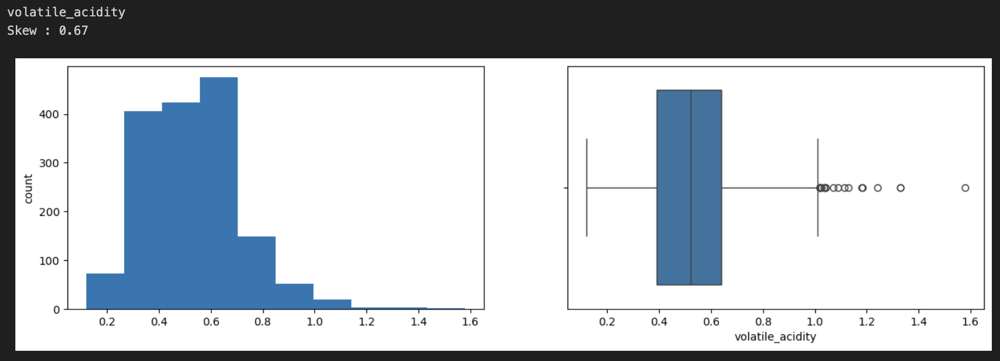
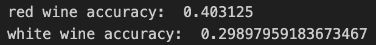
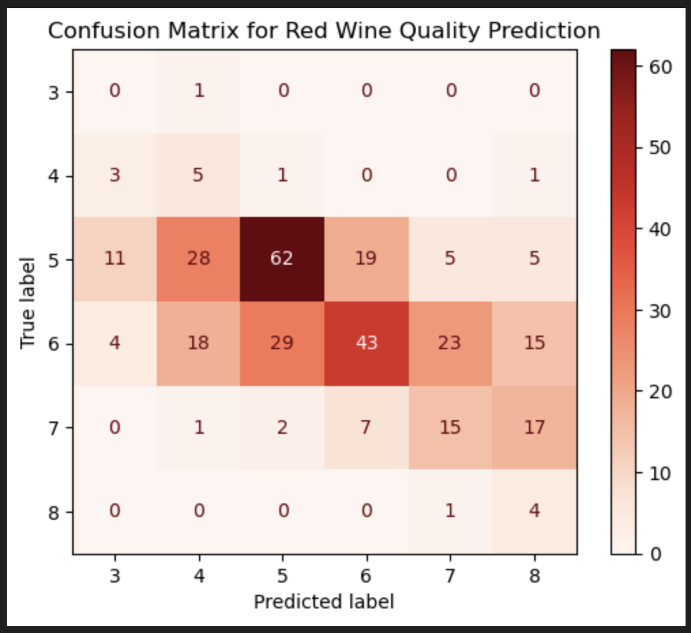

# Wine Quality Prediction

## Business Understanding
How does wine quality impact wine makers operational costs?
Wine producers could benefit from knowing how a "wine expert" would rate the quality of their wines. Wine quality information could be used to:
- Make wines in small batches and assess their quality before mass production
- Reduce waste of raw materials
- Decide whether a wine should be distribuited to specialized retail stores or to a general retail store
- Determine the bottling process

The ["Wine Quality"](https://archive.ics.uci.edu/dataset/186/wine+quality) dataset from UC Irvine was used for this analysis. Since red and white wines have distinct characteristics, separate data was collected for each type.

**Note:** This dataset pertains to Portuguese "Vinho Verde" wine, which may limit the generalizability of the model to wines from other regions. To mitigate this, additional wine quality data from various regions should be considered.

## Data Mining Goal
The objective of this project is to predict wine quality based on physicochemical test results. The target is to develop a model that achieves an accuracy of 85% or higher in quality predictions.

## Data Understanding
Two datasets are used: `winequality-red.csv` and `winequality-white.csv`, both using `;` as a delimiter. These files were loaded into dataframes for exploration. For a detailed exploratory data analysis (EDA), refer to the [wine notebook](wine.ipynb).

### Key Findings from EDA:
- No missing values in either dataset.
- Red wine data: 1,599 rows.
- White wine data: 4,898 rows.
- Both datasets have the same 11 features: `['fixed_acidity', 'volatile_acidity', 'citric_acid', 'residual_sugar', 'chlorides', 'free_sulfur_dioxide', 'total_sulfur_dioxide', 'density', 'pH', 'sulphates', 'alcohol']`, all of type float64.

- Statistical summaries indicate potential outliers. Box plots were used to visualize data distribution.

## Data Preparation
### Outlier Treatment
Two methods were used to treat outliers:
- KNN imputation
- Winsorization

Winsorization yielded better predictions than KNN imputation using a simple logistic regression model.

### Feature Selection
Feature selection techniques were applied to identify the most relevant features for modeling.

## Modeling
Various classifiers were evaluated, with a simple logistic regression model serving as the baseline. The datasets (red and white wine data) were split into training and testing subsets.

## Evaluation
The project's success criterion is achieving 80% or better prediction accuracy. The baseline model was evaluated using confusion matrices.

### Baseline Model Score:

#### Red Wine Confusion Matrix:

#### White Wine Confusion Matrix:
