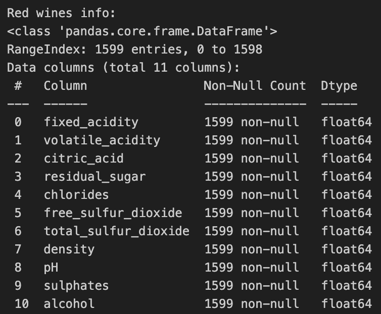
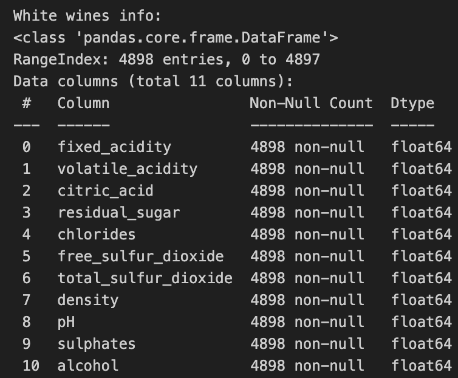

# How does wine quality impact wine makers' operational costs?

## Business Understanding
Wine producers could benefit from knowing how a "wine expert" would rate the quality of their wines. This information could be used to:
- Make wines in small batches and assess their quality before mass production. This could reduce waste of raw materials and production costs.
- Decide whether a wine should be distribuited to a specialized retail stores or to a general retail store
- Determine the bottling process. This could result in cost savings by using cheaper materials to bottle lower quality wines

UC Irvine published a wine quality dataset, which consists of two .csv files for red and white wines. The data can be found here: https://archive.ics.uci.edu/dataset/186/wine+quality

Two separate files for both red and white wines are necessary as their taste is quite different.

A potential risk of using this data is that it pertains to Portuguese "Vinho Verde" wine, which means that the data represents only a region of the world. One way to address this is to search for wine quality data that better represents wines from around the world.

## Data Mining Goal
The goal for this project is to predict wine quality from physicochemical tests results. A successful outcome for this project is to create a model that achieves 95% accuracy in quality predictions.

## Data Understanding
The two data files, `winequality-red.csv` and `winequality-white.csv`, use `;` as a delimiter. The files were loaded into two dataframes for exploration. For full exploratory data analysis, open the [wine notebook](wine.ipynb).

Neither data file contain missing values. The red wine data consists of 1,599 rows with 10 features, all of type float64. Similarly, the white wine data consists of 4,898 with 10 features, all of type float64.

## Data Preparation

## Modeling
A model that predicts the quality of a wine given its chemical composition was developed for this process. Several classificators were evaluated and the one who yield the highest accuracy was selected. Additionally, ensemble techniques were explored to ensure the highest accuracy could be obtained with either a singular model or an ensemble.

## Evaluation

## Exploratory Data Analysis