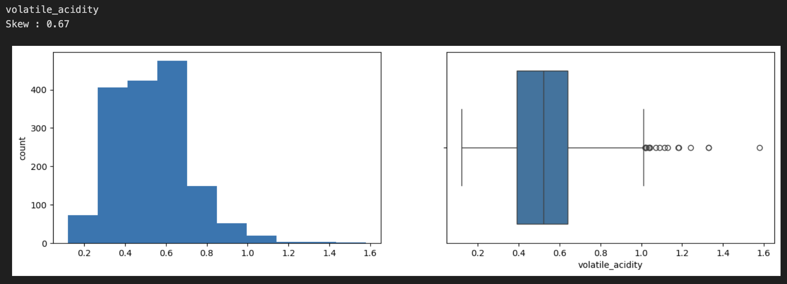
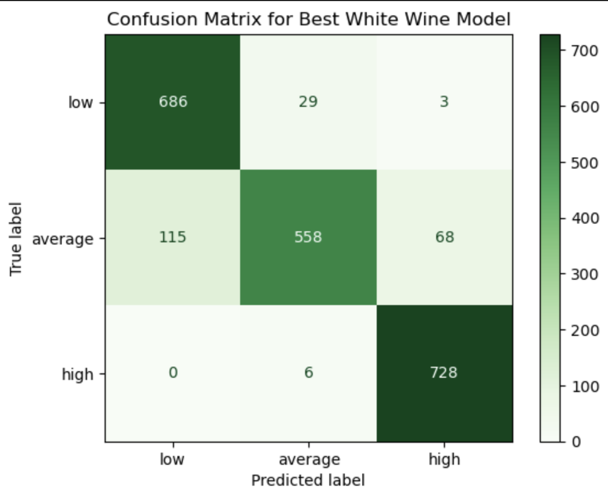

# Wine Quality Prediction

## 1. Business Understanding
### Problem Statement
How does wine quality impact winemakers' operational costs?

Wine producers can benefit from predicting how a wine expert would rate their wines. Understanding wine quality can help producers:
- Optimize production by assessing small batches before mass production.
- Reduce waste of raw materials.
- Determine whether a wine should be distributed to specialized retail stores or general retail stores.
- Improve bottling and storage decisions to maintain quality.

This project uses the [Wine Quality dataset](https://archive.ics.uci.edu/dataset/186/wine+quality) from UC Irvine. Since red and white wines have distinct characteristics, separate data was collected for each type.

**Note:** The dataset specifically pertains to Portuguese "Vinho Verde" wine, which may limit the generalizability of the model to wines from other regions. Additional wine quality data from various regions should be considered for broader applicability.

## 2. Data Understanding
### Dataset Overview
The dataset consists of two separate files:
- `winequality-red.csv`: Contains **1,599** samples of red wine.
- `winequality-white.csv`: Contains **4,898** samples of white wine.

Both datasets have **11 physicochemical attributes** (all numerical, float64 type):
- `fixed_acidity`, `volatile_acidity`, `citric_acid`, `residual_sugar`, `chlorides`, `free_sulfur_dioxide`, `total_sulfur_dioxide`, `density`, `pH`, `sulphates`, `alcohol`

Each sample is labeled with a **quality score (0-10)** assigned by wine experts.

#### Key Findings from Exploratory Data Analysis (EDA):
- No missing values in either dataset.
- The target variable (`quality`) is highly imbalanced.
- Box plots suggest the presence of potential outliers.

**Boxplot Visualization:**


For detailed data exploration, refer to the [wine notebook](wine.ipynb).

## 3. Data Preparation
### Outlier Treatment
While boxplots indicate potential outliers, domain knowledge suggests that some extreme values in free sulfur dioxide and total sulfur dioxide may indicate anomalies in the winemaking process. These anomalies could affect wine quality.

Thus, **no extensive outlier removal was performed**, except for removing **two extreme total sulfur dioxide values (>250) in the red wine dataset**, as these are considered true outliers:
```python
# Removing extreme total sulfur dioxide outliers
df_red_raw = df_red_raw[df_red_raw['total_sulfur_dioxide'] < 250]
```

### Target Variable Transformation
The `quality` variable has **10 possible classes (0-10)**, making classification challenging. To simplify modeling, the target variable was transformed into three categories:
- **Low Quality (0-4)**
- **Average Quality (5-6)**
- **High Quality (7-10)**

To address class imbalance, **SMOTE (Synthetic Minority Over-sampling Technique)** was applied to balance the dataset.

## 4. Modeling
Three classification models were evaluated:
- **K-Nearest Neighbors (KNN)**
- **Decision Trees**
- **Support Vector Machines (SVM)**

Hyperparameter tuning was performed using `GridSearchCV` to optimize model performance.

### Best Model Parameters
#### Red Wine:
- **KNN:** `{'model__n_neighbors': 3, 'model__weights': 'distance'}`
- **Decision Tree:** `{'model__max_depth': None, 'model__min_samples_split': 2}`
- **SVM:** `{'model__C': 10, 'model__kernel': 'rbf'}`

#### White Wine:
- **KNN:** `{'model__n_neighbors': 3, 'model__weights': 'distance'}`
- **Decision Tree:** `{'model__max_depth': 20, 'model__min_samples_split': 2}`
- **SVM:** `{'model__C': 10, 'model__kernel': 'rbf'}`

## 5. Evaluation
### Model Performance
Models were assessed using **accuracy** as the primary metric.

#### Baseline model:
Linear Regression


#### Red Wine Results:
| Model                  | Train Accuracy | Test Accuracy |
|------------------------|---------------|--------------|
| Logistic Regression    | 85%           | 83%          |
| K-Nearest Neighbors    | 92%           | 89%          |
| Decision Tree          | 100%          | 87%          |
| Support Vector Machine | 91%           | **91%**      |

#### White Wine Results:
| Model                  | Train Accuracy | Test Accuracy |
|------------------------|---------------|--------------|
| Logistic Regression    | 84%           | 82%          |
| K-Nearest Neighbors    | 91%           | **89%**      |
| Decision Tree          | 100%          | 86%          |
| Support Vector Machine | 90%           | 89%          |

**Best Performing Models:**
- **Red Wine:** Support Vector Machine (**91% accuracy**)
- **White Wine:** K-Nearest Neighbors (**89% accuracy**)

### Confusion Matrices
#### Red Wine (SVM):


#### White Wine (KNN):


## 6. Deployment and Next Steps
### Deployment Plan
- Deploy the **Support Vector Machine (Red Wine)** and **K-Nearest Neighbors (White Wine)** models to a production environment.
- Provide an API for real-time wine quality predictions.

### Monitoring and Maintenance
- Implement logging and monitoring to track model performance over time.
- Periodically retrain models with new data to maintain accuracy.

### Future Enhancements
- **Feature Engineering:** Explore additional features to improve predictive performance.
- **Ensemble Methods:** Experiment with Random Forests, XGBoost, or Neural Networks.
- **Wider Dataset:** Incorporate wine quality data from different regions to enhance model generalizability.