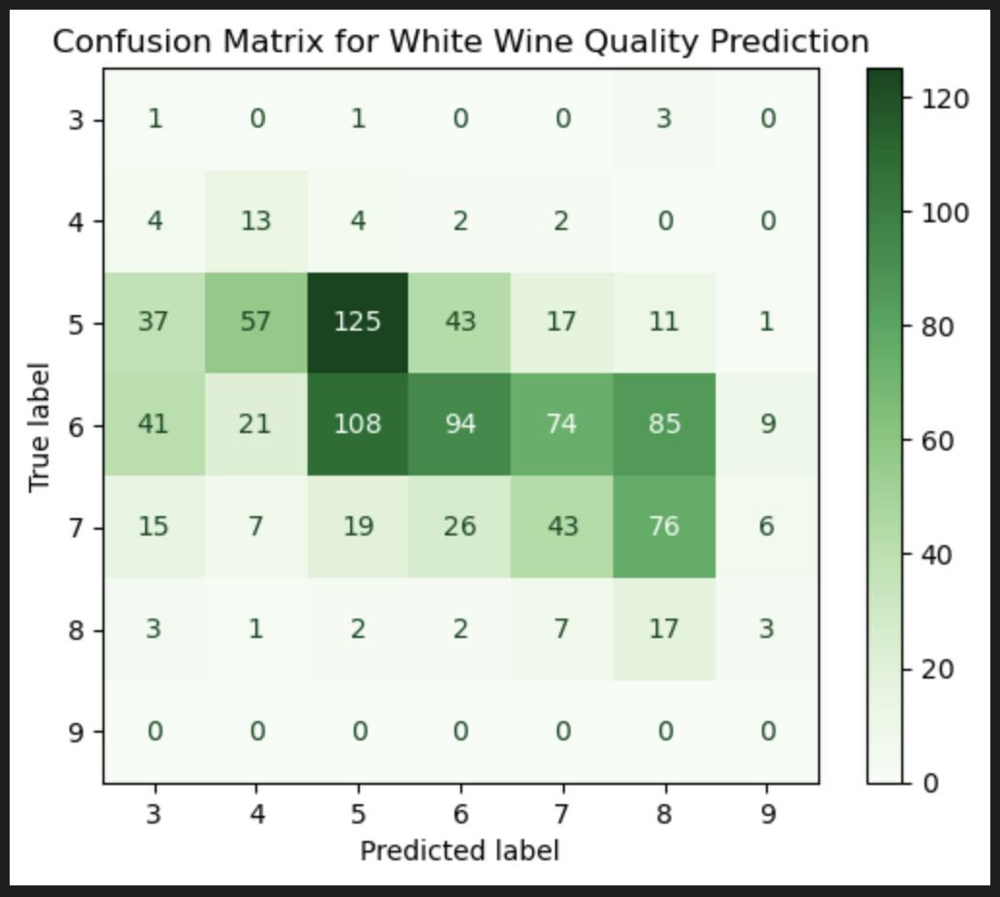

# Wine Quality Prediction

## Business Understanding
How does wine quality impact wine makers' operational costs?
Wine producers could benefit from knowing how a "wine expert" would rate the quality of their wines. Wine quality information could be used to:
- Make wines in small batches and assess their quality before mass production
- Reduce waste of raw materials
- Decide whether a wine should be distribuited to specialized retail stores or to a general retail store
- Determine the bottling process

The ["Wine Quality"](https://archive.ics.uci.edu/dataset/186/wine+quality) published by UC Irvine was used for this analysis. Because red and white wine taste quite different, the wine data was collected separatly for each wine.

A risk of using this data to train machine learning models is that it pertains to Portuguese "Vinho Verde" wine, so learning may not generalize to wines form other regions in the world. One way to mitigate this is to search for more wine quality data that better represent different regions from around the world.

## Data Mining Goal
The goal for this project is to predict wine quality from physicochemical tests results. A successful outcome for this project is to create a model that achieves 85% accuracy or better in quality predictions.

## Data Understanding
There are two different data sets for each type of wine, `winequality-red.csv` and `winequality-white.csv`, and they use and use `;` as a delimiter. The files were loaded into two dataframes for exploration. For full exploratory data analysis (EDA), open the [wine notebook](wine.ipynb).

Here are some findings during EDA: 
- Neither data file contain missing values. The red wine data has 1,599 rows while the white wine data has 4,898 rows. Both data sets have the same 10 features `['fixed_acidity', 'volatile_acidity', 'citric_acid', 'residual_sugar', 'chlorides', 'free_sulfur_dioxide', 'total_sulfur_dioxide', 'density', 'pH', 'sulphates', 'alcohol']`, all of type float64. Similarly. The target

- The statistical summary shows that there might be outliers in the data. Box plots were used to visualize the data distribuition
. Outliers treatment can be further down the document. 

## Data Preparation
### Outlier Treatment
- Two methods were used to treat outliers, KNN imputation and Winsorization
- Winsorization yielded better predications than KNN imputation using a simple logistic regression model

### Feature Selection

## Modeling
Different classifiers were evaluated using a simple logistic regression model as baseline. The two datasets (red and white wine data) were split into train and test subsets.

## Evaluation
Since the success of the project goal is to achieve 80% or better in prediction accuracy, the baseline model was evaluated using confusion matrices.

Here's the baseline model score:

